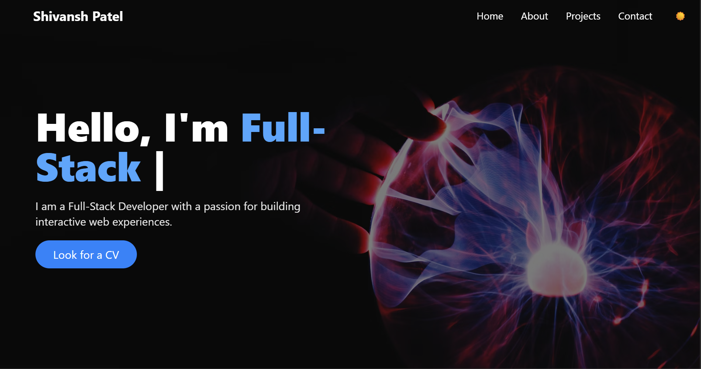
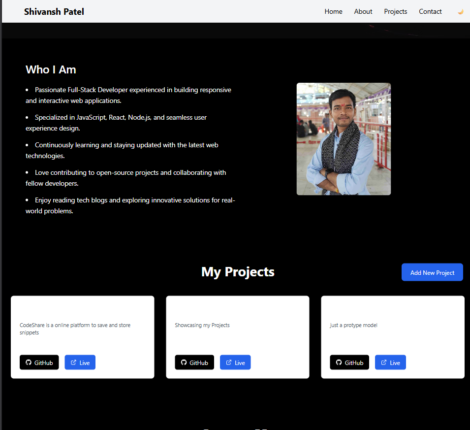

# 🚀 Portfolio Website

This repository contains the code for my personal portfolio website, which showcases my work and skills with a modern, responsive design and admin/project management features. The backend contains both the API and the frontend code for a seamless deployment.

---

## 📑 Table of Contents

- [💡 About](#about)
- [✨ Features](#features)
- [🛠️ Tech Stack](#tech-stack)
- [🔗 API Endpoints](#api-endpoints)
- [🖼️ Screenshots](#screenshots)
- [🚦 Getting Started](#getting-started)
  - [📥 Cloning the Repository](#cloning-the-repository)
  - [🔐 Setting up the .env File](#setting-up-the-env-file)
  - [🏁 Running the Application](#running-the-application)
- [📁 Project Structure](#project-structure)
- [📬 Contact](#contact)

---

## 💡 About

This is a full-stack portfolio website built with Vite.js (React frontend) and Node.js/Express (backend). It features secure project management (add projects as admin), a contact form (with email via Nodemailer), and a modern, responsive UI with Tailwind CSS, dark/light mode, and lazy loading.

---

## ✨ Features

- 📱 Responsive design (Tailwind CSS, dark/light mode)
- ⚡ Modern frontend (Vite.js, React)
- 🗄️ Backend API (Node.js + Express)
- 📧 Contact form with email (Nodemailer)
- 🔐 Authentication to add projects (admin-only)
- 💤 Lazy loading of images/assets
- 🔄 API and frontend merged in the backend for easy deployment

---

## 🛠️ Tech Stack

- **Frontend:** Vite.js, React, Tailwind CSS
- **Backend:** Node.js, Express.js
- **Email:** Nodemailer
- **Authentication:** Custom admin secret
- **Performance:** Lazy loading

---

## 🔗 API Endpoints

- **GET /getprojects**  
  📂 Retrieve all portfolio projects.

- **POST /add-project**  
  ➕ Add a new project. Requires admin authentication via `ADMIN_SECRET`.

- **POST /contact/submit**  
  ✉️ Send a contact message. Triggers an email via Nodemailer.

---

## 🖼️ Screenshots

- 
- 
- 

---

## 🚦 Getting Started

### 📥 Cloning the Repository

#### To view only the design:

```bash
git clone https://github.com/shivp0404/portfolio.git
cd portfolio/frontend
npm install
npm run dev
```

#### To run the full-fledged website (backend includes frontend):

```bash
git clone https://github.com/shivp0404/portfolio.git
cd portfolio/backend
npm install
```

### 🔐 Setting up the .env File

Create a `.env` file **inside the `backend` directory** with the following contents:

```env
EMAIL_USER="YOUR_GMAIL_USER_ID"
EMAIL_PASS="YOUR_GMAIL_APP_PASSWORD"
ADMIN_SECRET="YOUR_PASSWORD_TO_ADD_PROJECTS"
```
- `EMAIL_USER`: Your Gmail address (for sending contact form emails)
- `EMAIL_PASS`: Gmail App Password (not your main Gmail password)
- `ADMIN_SECRET`: Password required to add projects as admin

**⚠️ Note:** Do NOT commit your `.env` file to version control.

---

### 🏁 Running the Application

From the `backend` directory, start the project with:

```bash
npm run dev
```

- The backend will also serve the frontend (React build) for a seamless experience.

---

## 📁 Project Structure

```
portfolio/
│
├── frontend/       # Vite.js + React + Tailwind CSS
│
├── backend/        # Node.js + Express backend, includes frontend
│   ├── index.js
│   ├── .env (you create this)
│   ├── routes/
│   ├── controllers/
│   └── ...
│
├── screenshots/
│   ├── home.png
│   ├── project.png
│   └── contact.png
│
└── README.md
```

---

## 📬 Contact

- **GitHub:** [shivp0404](https://github.com/shivp0404)
- **Email:** [shivanshpatel1432.email@example.com]

---

✨ Feel free to open issues or contribute!
